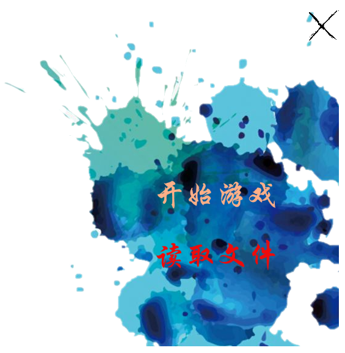

# 葫芦娃小游戏
_使用javaFx作为框架编写,并根据MVC框架将视图和控制分离_  
## 1.使用方法
### 1.1 运行游戏
&nbsp;&nbsp;&nbsp;&nbsp;通过双击ljy.jar运行游戏，进入如下准备界面 

点击“**开始游戏**”开始一个新游戏，点击“**读取文件**”读取一个存档，点击右上角的"**X**"退出游戏。所有窗口都可以拖动调整位置 
### 1.2 新游戏
&nbsp;&nbsp;&nbsp;&nbsp;开始一个新游戏后会首先进入一段入场动画，此时无法执行操作。

等到所有人物入场完毕后即可开始游戏。
#### 1.2.1 移动
&nbsp;&nbsp;&nbsp;&nbsp;使用鼠标选中一个角色后再点击空白区域即可将该角色移动到目的地。
- 无法移动到有角色的位置
> 待实现：人类的物理阻挡移动尚未移植到此版本中。
#### 1.2.2 攻击
&nbsp;&nbsp;&nbsp;&nbsp;选中一个角色后左侧会弹出技能栏，由上到下有三个按钮分别为普通攻击、对群攻击和必杀技攻击。不同角色和攻击种类的攻击效果不同。
- 普通攻击： 普通攻击可以使用无限次，没有远程属性的角色会攻击面前的敌人，具有远程属性的角色可以攻击在同一行上远距离的敌人。
- 对群攻击：对群攻击会消耗一定的MP，会对前、上、下三个位置的敌人造成伤害。
- 必杀技攻击：必杀技攻击每个角色每回合只能使用一次，不消耗MP，具有极高的伤害，攻击范围同普通攻击。
_无法使用的攻击方式不会在属性栏中再出现_
#### 1.2.3 治疗
&nbsp;&nbsp;&nbsp;&nbsp;某些角色为辅助角色，只能够为己方治疗，不能够攻击敌人。人类方为具有远程治疗能力的**爷爷**，妖怪方面为具有近程治疗能力的**蛇精**，使用方法和攻击一致。
#### 1.2.4 人物状态
&nbsp;&nbsp;&nbsp;&nbsp;鼠标移动到角色上时下方会弹出角色的属性栏，包括角色的HP和MP。属性框会在无操作两秒后隐藏。
> 以后可能会加入攻击力等更详尽的信息。
#### 1.2.5 死亡
&nbsp;&nbsp;&nbsp;&nbsp;角色HP耗尽后会死亡并变成墓碑，退出战斗。
#### 1.2.6 妖怪
&nbsp;&nbsp;&nbsp;&nbsp;妖怪分为如下三种，分别具有不同特性：
- 蝎子精：
 - 是小妖怪的首领，妖怪阵营的首领，具有极强的攻击力和血量，如果将其击溃则小妖精不会再变换阵型。
 - _Tips: 蝎子精在第二回合后可以使用群攻型必杀技，即带领所有小妖怪使用必杀技。_
 - _Tips: 注意!蝎子精胆子很小，如果受到大量伤害会变阵退到阵型的最后方，因此最好抓住机会在一个回合内一击必杀。_
- 小喽啰：
 - 最基础的小妖怪，不具有远程攻击能力，攻击力和HP值都很低，不过数量众多。
- 蛇精：
 - 辅助型妖怪，具有比爷爷还要强大的对群治疗能力，会在每回合对妖怪进行一次治疗。
 - _Tips: 为了避免被小妖怪消耗致死，需要尽快击破蛇精后减少小妖怪的数量。
>以后可能会增加双人对战模式。
#### 1.2.7 回合
&nbsp;&nbsp;&nbsp;&nbsp;本游戏为回合制游戏，每个回合人类具有三次有效操作机会（移动，攻击，治疗），剩余操作数会以蓝色圆球的方式在窗口上方显示：   
人类操作用尽后会进入妖怪攻击回合，包含如下三个部分：
 - 所有攻击型妖怪具有一次任意方式攻击机会
 - 蝎子精可以选择是否变阵
 - 蛇精会寻找受伤的妖怪治疗
#### 1.2.8 胜负判定
&nbsp;&nbsp;&nbsp;&nbsp;当一方阵营全部被消灭后游戏结束，弹出结束提示，游戏结束后可以继续操作人物，不过系统不再保存人物行为。  
_下面是一个完整的回合演示：_

### 1.3 保存游戏
&nbsp;&nbsp;&nbsp;&nbsp;随时可以保存游戏，点击游戏界面右上角的保存图标 即可保存当前进度，游戏进度会保存为xml文件。
### 1.4 读取进度
&nbsp;&nbsp;&nbsp;&nbsp;在准备界面点击“**读取文件**”后选择一个之前保存的文件即可开始读取。目前的实现的自动播放一遍之前的所有游戏过程后，此阶段无法控制人物。在加载完毕后即可继续游戏。  
> 之后会考虑增加直接加载到当前状态的选项
### 1.5退出游戏
&nbsp;&nbsp;&nbsp;&nbsp;在准备界面和游戏界面右上角都有关闭按钮 ，点击即可关闭游戏。
