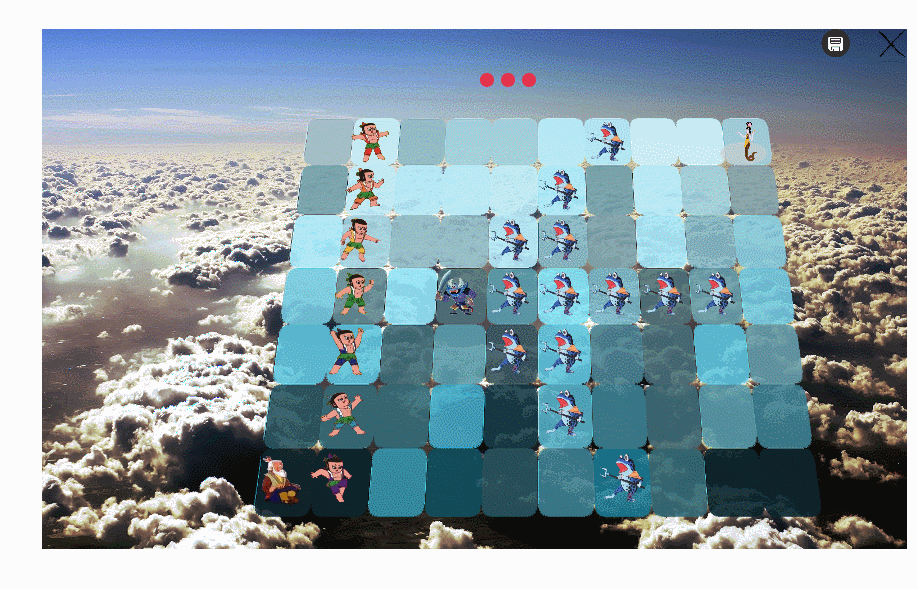

# 葫芦娃小游戏
_使用javaFx作为框架编写,并根据MVC框架将视图和控制分离_ <br>
_双击SimpleHuluGameFx.jar运行游戏_ <br>
_或进入proj文件夹使用命令`mvn package`执行测试并生成jar可执行文件，`java -jar target\hulagame-1.0-SNAPSHOT.jar`运行游戏_ <br>
_120181227.xml为一次游戏的存档，正确读档后会重现妖怪的一次胜利过程（剩下最后一击由您完成）_
## 1.使用方法
### 1.1 运行游戏
&nbsp;&nbsp;&nbsp;&nbsp;通过双击ljy.jar运行游戏，准备界面<br>
点击“**开始游戏**”开始一个新游戏，点击“**读取文件**”读取一个存档，点击右上角的"**X**"退出游戏。所有窗口都可以拖动调整位置<br>
### 1.2 新游戏
&nbsp;&nbsp;&nbsp;&nbsp;开始一个新游戏后会首先进入模式选择界面，共有“控制人类战斗”，“控制腰妖怪战斗”，“自动战斗”，““双人模式”四种游戏模式。

* 控制人类战斗：点击左侧的葫芦兄弟头像即可开始协助人类战斗。
* 控制妖怪战斗：点击右侧的蝎子精头像即可开始协助妖怪战斗。
* 自动战斗：点击自动战斗后人类和妖怪将由电脑控制开始战斗。
* 双人模式：两名玩家分别控制人类和妖怪互相进攻。 <br>
开始游戏后会有一段入场动画，等到所有人物入场完毕后即可开始游戏。


#### 1.2.1 移动
&nbsp;&nbsp;&nbsp;&nbsp;使用鼠标选中一个角色后再点击空白区域即可将该角色移动到目的地。
- 无法移动到有角色的位置
#### 1.2.2 攻击
&nbsp;&nbsp;&nbsp;&nbsp;选中一个角色后左侧会弹出技能栏，由上到下有三个按钮分别为普通攻击、对群攻击和必杀技攻击。不同角色和攻击种类的攻击效果不同。
* 普通攻击： 普通攻击可以使用无限次，没有远程属性的角色会攻击面前的敌人，具有远程属性的角色可以攻击在同一行上远距离的敌人。
* 对群攻击：对群攻击会消耗一定的MP，会对前、上、下三个位置的敌人造成伤害。
* 必杀技攻击：必杀技攻击每个角色每回合只能使用一次，不消耗MP，具有极高的伤害，攻击范围同普通攻击。
_无法使用的攻击方式不会在属性栏中再出现_
#### 1.2.3 治疗
&nbsp;&nbsp;&nbsp;&nbsp;某些角色为辅助角色，只能够为己方治疗，不能够攻击敌人。人类方为具有远程治疗能力的**爷爷**，妖怪方面为具有近程治疗能力的**蛇精**，使用方法和攻击一致。
#### 1.2.4 人物状态
&nbsp;&nbsp;&nbsp;&nbsp;鼠标移动到角色上时下方会弹出角色的属性栏，包括角色的HP和MP。属性框会在无操作两秒后隐藏。
#### 1.2.5 死亡
&nbsp;&nbsp;&nbsp;&nbsp;角色HP耗尽后会死亡并变成墓碑，退出战斗。
#### 1.2.6 人类
&nbsp;&nbsp;&nbsp;&nbsp;人类阵营包括七个葫芦娃和爷爷。
* 爷爷：
    * 爷爷是人类阵营的辅助角色，可以远程治疗其他人类。
* 葫芦兄弟：
    * 大娃HP最多(120)，并且必杀技攻击力极强(90)，不过普通攻击(10)和对群攻击(20)较弱。
    * 二娃为远程攻击角色，并且对群攻击可以释放出闪电，威力极强(40)。
    * 三娃为远程攻击角色，普通攻击很弱(5)，不过必杀技很强(80),可以在后方协助近战角色实现斩首战术。
    * 四娃负责主要攻击输出，生命值很低(60)，不过对群攻击(40)和必杀技(90)都极高，在战场上经常需要爷爷的治疗。
    * 五娃为综合能力最强的角色，三种攻击力分别为(20,30,90)，且血量为(100)。
    * 六娃血量(150)和普通攻击(30)都很高，适合冲锋在最前方。
    * 七娃是最弱的角色。

#### 1.2.7 妖怪
&nbsp;&nbsp;&nbsp;&nbsp;妖怪分为如下三种，分别具有不同特性：
* 蝎子精：
    * 是小妖怪的首领，妖怪阵营的首领，具有极强的攻击力和血量，如果将其击溃则小妖精不会再变换阵型。
    * 蝎子精使用普通攻击\必杀技时其他小喽啰也会一起普通攻击\必杀技
    * 蝎子精使用对群攻击时其他小喽啰会变阵
    * _Tips: 蝎子精在第二回合后可以使用群攻型必杀技，即带领所有小妖怪使用必杀技。_
    * _Tips: 注意!蝎子精胆子很小如果受到大量伤害会变阵退到阵型的最后方，因此最好抓住机会在一个回合内一击必杀。_
* 小喽啰：
    * 最基础的小妖怪，不具有远程攻击能力，攻击力和HP值都很低，不过数量众多。
* 蛇精：
    * 辅助型妖怪，具有比爷爷还要强大的对群治疗能力，会在每回合对妖怪进行一次治疗。
    * _Tips: 为了避免被小妖怪消耗致死，需要尽快击破蛇精后减少小妖怪的数量。
#### 1.2.8 回合
&nbsp;&nbsp;&nbsp;&nbsp;本游戏为回合制游戏，为平衡人类和妖怪的实力，每个回合协助人类时具有三次有效操作机会（移动，攻击，治疗），协助妖怪时有两次有效。 <br>
_使用妖怪阵营时操纵小妖怪布阵不消耗操作机会_
* 人类剩余操作数会以红色圆球的方式在窗口上方显示：  <br>
* 妖怪剩余操作数会以红色圆球的方式在窗口上方显示：  <br>
玩家操作用尽后会进入敌人的攻击回合，包含如下三个部分：
* 妖怪的自动攻击(玩家选择人类阵营)：
    * 所有攻击型妖怪具有一次任意方式攻击机会
    * 蛇精会寻找受伤的妖怪治疗
    * 蝎子精可以选择是否变阵
* 人类的自动攻击(玩家选择妖怪阵营)：
    * 所有葫芦娃移动一次到合适的攻击地点
    * 所有葫芦娃可以进行一次攻击，近战葫芦娃会优先使用必杀技，远程葫芦娃会将必杀技留给蝎子精
    * 爷爷会寻找受伤的葫芦娃治疗
_下面是操纵人类战斗两个回合的演示：_

#### 1.2.9 胜负判定
&nbsp;&nbsp;&nbsp;&nbsp;当一方阵营全部被消灭后游戏结束，弹出结束提示，游戏结束后可以继续操作人物，不过系统不再保存人物行为。 <br>
#### 1.2.10 自动战斗
&nbsp;&nbsp;&nbsp;&nbsp;自动战斗模式下人类和妖怪会自主按照自己的战斗逻辑战斗，此时无法控制角色，只能查看角色状态。
_下面是一小局自动战斗的演示：_


### 1.3 保存游戏
&nbsp;&nbsp;&nbsp;&nbsp;随时可以保存游戏，点击游戏界面右上角的保存图标 即可保存当前进度，游戏进度会保存为xml文件。
### 1.4 读取进度
&nbsp;&nbsp;&nbsp;&nbsp;在准备界面点击“**读取文件**”后选择一个之前保存的文件即可开始读取。目前的实现的自动播放一遍之前的所有游戏过程后，此阶段无法控制人物。在加载完毕后即可继续游戏。 <br>
_为了增强游戏体验，读取进度时角色移动动画和攻击动画都会加倍播放。_
### 1.5退出游戏
&nbsp;&nbsp;&nbsp;&nbsp;在准备界面和游戏界面右上角都有关闭按钮 ，点击即可关闭游戏。
## 版本说明
* 20181219: 
    * 在左上角增加用来调试的小地图，蓝色代表人类、红色代表妖怪、白色代表空地。
    * 更改游戏存档文件的储存格式，以适应双人游戏模式或自动战斗模式存档。
    * 修复人物受到攻击后没受伤害的bug
    * 改变布局为10*7网格，并增加变阵判定，如果新阵形中已有敌方角色则蝎子精无法变阵。
    * 回放模式下人物移动速度和攻击速度会加倍
    * 增加控制妖怪和自动战斗两个新玩法
* 20181226(v2.0)：
    * 这应该是最终版本，以后不会做出重大修改。
    * 本次更新新增内容如下：
        * 修复了操纵葫芦娃的机器人逻辑问题
        * 加入了注解
        * 加入测试代码
        * 对之前的界面进行美化
        * 将战场修改成假三维模式，通过透视映射使战场具有纵向深度
<br>
<br>
<br>
<br> 
<br> 
<br> 
<br> 
<br> 

## 2.设计思路
&nbsp;&nbsp;&nbsp;&nbsp;此版本和之前版本设计思路完全不同，采用了MVC设计模式，javaFx开发框架。下面从Model, View和Control三个方面简述设计思路。
### 2.1 资源管理
&nbsp;&nbsp;&nbsp;&nbsp;为了方便资源管理，将程序需要的所有属性和资源都封装到抽象类**Configs**和**ViewBundle**中。
* **Configs**中保存窗口布局相关的数值属性和游戏中人物贴图和其他游戏中使用的系统贴图，所有贴图通过ArrayList储存，并提供`static final int`下标按照如下命名格式进行索引。
```Java
    //贴图索引
    public static final int INDEX_PREBACKGROUND = 0;
    public static final int INDEX_BACKGROUND = 1;
    public static final int INDEX_START = 2;
    public static final int INDEX_LOAD = 3;
    public static final int INDEX_CLOSE = 4;
    public static final int INDEX_DCLOSE = 5;
    //...
    //布局属性
    public static int WIN_HEIGHT;
    public static int WIN_WIDTH;
    public static int TOP_MARAGIN;
    public static int BOTTOM_MARAGIN;
    public static int LEFT_MARGIN;
    public static int RIGHT_MARGIN;
    //...
```
* **ViewBundle保存所有角色的攻击效果贴图，同样按照index寻址
## 3.0 MVC模式说明
### 3.1 模型Model
&nbsp;&nbsp;&nbsp;&nbsp;本游戏主要模型即角色（Charactor）。
#### 3.1.1 角色：
每个角色都运行在一个线程中，具有攻击力、HP、MP等战斗属性和当前位置、移动、存活等其他属性。**Charactor**的主要逻辑如下：
```Java
    /** 角色在真实画布上的位置*/
    public AtomicInteger PositionX=new AtomicInteger(0), PositionY=new AtomicInteger(0);
    /** 当前是否正在执行操作*/
    public AtomicBoolean avaliable=new AtomicBoolean(true);
    /** 用于接收命令*/
    public AtomicInteger cmd=new AtomicInteger(0);

    @Override
    public void run() {
        while (true) {
            try {
                Thread.sleep(50);
            } catch (Exception e) {
                e.printStackTrace();
            }
            cmdHandler();       //命令处理函数
        }
    }

    /** 在循环中等待新命令*/
    protected void cmdHandler()
    {
        switch (cmd.get())
        {
            case 0: break;                  //当前无任务
            case 1: WalkToDst(); cmd.set(0);break;       //1 号命令为移动到目的地
            case 2: Attack1(); cmd.set(0); break;        //2 号命令为普通攻击
            case 3: Attack2(); cmd.set(0); break;        //3 号命令为对群攻击
            case 4: Attack3(); cmd.set(0); break;        //4 号命令为必杀攻击
            default: break;
        }
    }
```
* 移动：角色移动过程中会在线程中定时更新自己的坐标和当前贴图的描述，**OutlookManager**定期使用对应的的贴图重绘即可形成移动的动画。
* 攻击：每个攻击效果(Bullet)对象具有自己的位置和贴图属性，**Charactor**通过一个静态类**bulletController**获得攻击效果移动的逻辑后更新Bullet的位置，**OutlookManager**定期将攻击效果绘制在Canvas上形成攻击动画。
### 3.2 视图View
&nbsp;&nbsp;&nbsp;&nbsp;在javaFx中我使用的主要视图控件为没有布局的Pane，游戏界面的主要控件如下：
* 场景**Stage**：
    * 场景中的Pane负责承载所有其他UI对象，并接收鼠标行为，并将MouseEvent传递给**battleManager**做出解析。
* 画布**Canvas**:
    * 画布用来绘制所有战斗动画效果并形成一个FPS动画，由视图控制类**OutlookManager**控制每秒更新36次，形成连贯动画。
* 技能栏**SelectionBar**：
    * 技能栏负责显示当前人物可用的技能，接收使用技能的命令，并传递给战斗控制类**battleManager**处理。当前无选择角色时会隐藏，重新选中角色后battleManager会通知技能栏更新数据并弹出。
* 属性栏**CInfoBar**：
    * 属性栏负责显示当前鼠标经过的角色当前属性，内置一个计时器，会在无操作两秒后隐藏，**battleManager**在需要出现时通知属性栏弹出。
### 3.3 控制Control
&nbsp;&nbsp;&nbsp;&nbsp;游戏中主要的控制类有三个：控制战斗逻辑的**battleManager**，负责刷新界面的**OutlookManager**，控制人类行为的**hBot**类和负责控制妖怪行为的**mBot**类，其中后三者都为前者的成员变量。所有控制类都有一个角色数组储存所有角色的引用。
* **battleManager**
    * battleManager会创建所有角色并开始其线程，其主要逻辑如下：
```Java
    static final int ACTION_CLICKED = 0;
    static final int ACTION_MOVEABOVE = 1;
    /** 接收一个鼠标事件*/
    public Charactor newAction(iPoint loc, int type)
    {
        //重放时不能控制角色
        if(type == ACTION_CLICKED && autoplaying)
            return null;
        for(Charactor x: creatures)
        {
            if(x.alive && x.avaliable.get())
            {
                iPoint vp = virtualField.rpTovp(x.PositionX.get()+Configs.B_SIZE/2, x.PositionY.get()+Configs.B_SIZE/2);
                if(loc.x==vp.x && loc.y==vp.y)
                {
                    if(type == ACTION_CLICKED)  //如果是点击则为选择一个人类角色
                        ChatSelected = x;
                    if(type == ACTION_MOVEABOVE || (!bind.get() && !x.monster))  //如果为鼠标经过则为显示角色属性
                        return x;
                 }
            }
        }
        if(type == ACTION_CLICKED) {
            if(ChatSelected!=null && ChatSelected.monster)
                ChatSelected = null;
            //TODO: 通知当前选中角色移动，保存玩家操作并减少玩家步数
            if(!bind.get() && ChatSelected != null)
            { ... }
        }
        return null;
    }

    /** 玩家步数减少1，并且判断是否轮到敌人进攻*/
    public void stepDecrease()
    {
        if(End)
            return;
        stepRemain--;           //步数减一
        view.hint.set(stepRemain);
        if(stepRemain==0)       //轮到妖怪回合
        {
            bind.set(true);     //禁用玩家操作
            new Thread(()->{
                while(true)     //等待所有角色结束当前行为
                { ... }
                bot.nextMove();  //阻塞等待怪物完成自己的回合
                bind.set(false); //启用玩家操作
            }).start();
            stepRemain = 3;
            view.hint.set(stepRemain);
        }
    }

    /** 游戏结束，通知View执行结束动画并终止战斗逻辑*/
    public void GameEnd(boolean monster)
    { ... }
```
* **OutlookManager**
    * OutlookManager本身为一个线程，每1/36s会重绘一次Canvas制作逐帧动画，需要注意的是所有与视图相关操作都需要在主线程中完成，这里在重绘时使用了Platform.runlater避免出现同步问题。
* **mBot**和**hBot**
    * Bot类封装的是电脑控制的战斗逻辑，提供`public void nextMove()`接口，计算、通知、并阻塞等待所有妖怪\人类完成自己的行为。
## 4.0 其他重要组件
### 4.1 游戏保存
**SaveStack**负责保存游戏进度，提供如下接口：
```Java
    /**
     * 添加一次操作信息
     * @param chatId 角色ID
     * @param dstx 移动目的地横坐标
     * @param dsty 移动目的地纵坐标
     * @param type 操作类型
     */
    public void addMove(int chatId, int dstx, int dsty, int type)
```
每次玩家做出有效操作后battleManager或SelectionBar会调用此接口保存玩家操作，点击保存按钮后会将当前xml树写入文件。保存时采用xml文件，格式如下：
```xml
<?xml version="1.0" encoding="UTF-8" standalone="no"?>
<battle>
    <ctime>2018-12-19 02:38:22</ctime>
    <battle>
        <move ChatId="3" X="2" Y="3" fmt="0">0</move>
        <move ChatId="3" X="0" Y="0" fmt="0">4</move>
        <move ChatId="3" X="0" Y="0" fmt="0">2</move>
        <move ChatId="8" X="0" Y="0" fmt="0">5</move>
        <move ChatId="9" X="9" Y="0" fmt="0">0</move>
    </battle>
</battle>

```
### 4.2 读取进度
**AutoPlayer**负责解析xml文件并在线程中控制每个角色的行为，**battleManager**会一直设置禁用玩家操作直到读取结束（此线程结束）。
### 4.3 线程同步问题
* 所有只涉及同步读写的简单同步问题（如角色的位置）都使用Atomic变量保证同步。
* 所有视图相关操作都在主线程中完成。
* 属性栏和技能栏的自动弹出/消失存在较复杂的同步问题，如在弹出过程中接收到消失指令。这里使用两个Lock锁和一个boolean变量hide保证同步具体逻辑见CinfoBar.java或SelectionBar.java中的Hide和Showup方法。
* 发现在变阵时会出现如下问题：~~不同人物在并行的擦出、写入cmap时出现同步问题~~：
>例：
A,B线程在数组中移动，其中A: 1->2、B: 3->1 <br>
&nbsp;&nbsp;&nbsp;&nbsp;B: clear 3 <br>
&nbsp;&nbsp;&nbsp;&nbsp;B: write 1 <br>
&nbsp;&nbsp;&nbsp;&nbsp;A: clear 1 <br>
&nbsp;&nbsp;&nbsp;&nbsp;A: write 2 <br>
如按照上述顺序执行则B会消失。

 * 已经通过移动后重新刷新cmap修复。
### 4.4 战场透视映射
&nbsp;&nbsp;&nbsp;&nbsp;由于之前视图时通过虚拟坐标映射、并且将视图和控制分离，因此实际上不需要对模型进行修改，这也是MVC模式的方便之处。
&nbsp;&nbsp;&nbsp;&nbsp;只需在**OutLookManager**绘制FPS每一帧时进行透视坐标转换即可，透视算法在知道四个基准点的映射前后位置实际上可以看作线性插值。之前方格的布局是通过Configs.B_SIZE设定的，为了完成透视映射为Configs增加如下方法：
```Java
    /** 判断坐标(x,y)是否在row, col透视后的四边形中。*
     * @return 如果在四边形中则返回此四边形的属性Block, 否则返回null
     */
    public static Block IsInBlock(double x, double y, int row, int col)
    /**
     * 获得一个透视后方格的属性
     * @param x 透视前纵坐标
     * @param y 透视前横坐标
     * @return Block对象，描述方格的属性
     */
    public static Block SPEC_MID_SIZE(int x, int y)
```
其中Block(Configs.java)中包含了透视映射后的梯形位置信息。
### 4.5 注解
&nbsp;&nbsp;&nbsp;&nbsp;在Annotations.java文件中定义了注解类型IsCharactor和用于解析注解并生成说明文档的HintGenerater类。
#### IsCharactor
&nbsp;&nbsp;&nbsp;&nbsp;**IsCharactor**包含一个人物的姓名、战斗属性等基本属性，对所有继承自Charactor类的角色都添加此注解。
#### HintGenerater
&nbsp;&nbsp;&nbsp;&nbsp;HintGenerater使用了单例模式，每次运行游戏只会生成一个文档，并且生成完毕后立刻销毁HintGenerater对象，主要代码如下：
```Java
class HintGenerater{
    static HintGenerater generater;
    static Class[] clazzlist = {Grandpa.class, Scorpion.class, Snake.class};
    static String helpstring = "";
    static{
        generater = new HintGenerater();
    }
    private HintGenerater(){ }  //隐藏初始化器
    public static boolean GenerateHintDoc(){
        if(generater==null)
            return false;
        CucurbitBoys[] brothers = CucurbitBoys.values();
        for(CucurbitBoys boy:brothers)
        { ...//由于葫芦娃是通过enum类生成的，因此无法需要单独解析 }
        for(Class clazz:clazzlist)
        {
            if(clazz.isAnnotationPresent(IsCharactor.class))
            { ...//解析注解内容 }
        }
        //保存到文件Hint.txt中
        generater = null;   //生成后即销毁HintGenerater
        return true;
    }
}
```
### 4.6单元测试
&nbsp;&nbsp;&nbsp;&nbsp;使用JUnit实现了两个测试，检测是否缺失资源文件和检测UI布局属性是否正确、检测虚拟坐标和真实坐标相互转换算法是否正确。 <br>
&nbsp;&nbsp;&nbsp;&nbsp;**需要注意使用JavaFx直接做测试时会抛出`Internal graphics not initialized yet`异常，我直接为AppTest类增加了一个JFXPanel初始化Graphic。** <br>
测试代码如下：
```Java
    @Test
    public void testConfigs()
    {
        try{
            Configs.initialize();
        }catch (IllegalArgumentException e){
            assertTrue("贴图加载失败，请重新下载贴图",false); //如果缺少贴图则在加载是会抛出无效URL的异常
        }catch (Exception e){
            assertTrue("未知加载错误",false);        //其他异常
        }
        //MARK: 左侧边界+右侧边界+战斗区域 = 窗口宽度
        assertTrue("横向布局参数错误",Configs.LEFT_MARGIN + Configs.B_SIZE*Configs.B_WNUM + Configs.RIGHT_MARGIN == Configs.WIN_WIDTH);
        //MARK: 上方边界+上方边界+战斗区域 = 窗口高度
        assertTrue("纵向布局参数错误",Configs.TOP_MARAGIN + Configs.B_SIZE*Configs.B_HNUM + Configs.BOTTOM_MARAGIN == Configs.WIN_HEIGHT);
        assertTrue( true );
    }

    @Test
    public void testVpToRp()
    {
        Configs.initialize();
        Random random = new Random();
        //MARK:100次随机坐标转换测试, 测试坐标应该落在同一个格子中，即返回的虚拟坐标为(3,2)
        iPoint result;
        for(int i=0;i<100;i++)
        {
            //相当于随机在B_SIZE*B_SIZE的方格内选点后判断在哪个格子内
            result = virtualField.rpTovp(Configs.LEFT_MARGIN + 3 * Configs.B_SIZE + random.nextInt(Configs.B_SIZE-1),
                    Configs.TOP_MARAGIN + 2 * Configs.B_SIZE + random.nextInt(Configs.B_SIZE-1));
            assertTrue( "实际坐标到虚拟坐标转换错误",result.x == 3 && result.y == 2);
        }
        result = virtualField.vpTorp(0,0);
        //测试(0,0)虚拟方格的起始坐标应该恰好为上方边界宽度和左侧边界宽度。
        assertTrue( "虚拟坐标到实坐标转换错误",result.x == Configs.LEFT_MARGIN && result.y == Configs.TOP_MARAGIN);
        assertTrue(true);
    }
```